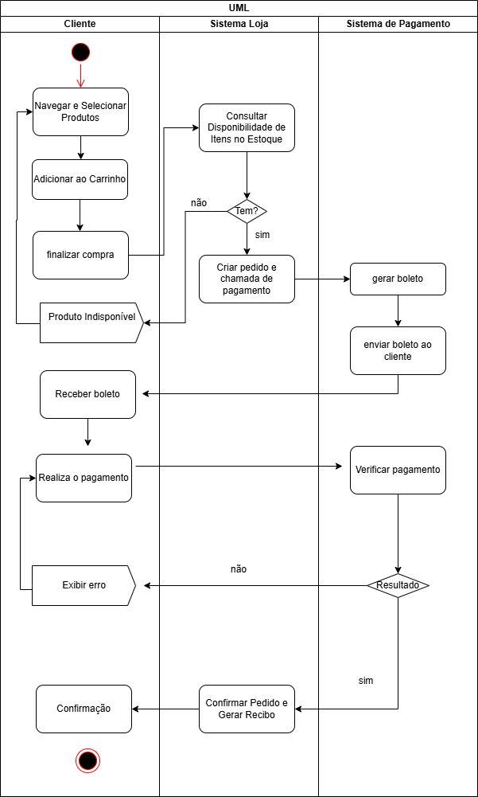
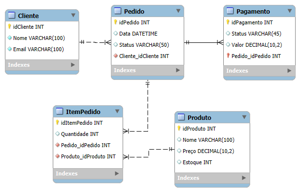

# LojinhaOnline — AgroTech

Projeto de simulacao de uma lojinha online feito em Java para a disciplina de Sistemas Distribuidos.
O sistema simula o fluxo completo de uma compra: desde a identificacao do cliente ate o processamento do pagamento.

---

## Como rodar o projeto

Voce precisa ter o Java JDK 11 ou superior instalado.

Abra o terminal dentro da pasta `ATVLojinhaOnline` e execute os dois comandos abaixo:

```bash
# 1. Compila todos os arquivos Java
find src -name "*.java" | xargs javac -d out

# 2. Roda o sistema
java -cp out controller.LojaAgroTechAPI
```

O sistema vai executar e mostrar no terminal cada etapa da simulacao.

---

## O que o sistema faz

Ao rodar, o sistema passa pelas seguintes etapas:

1. Identifica um cliente cadastrado
2. Lista os produtos disponíveis no catalogo
3. Tenta comprar um produto sem estoque (para mostrar o fluxo de erro)
4. Cria um pedido com um produto disponivel
5. Processa o pagamento via gateway externo (simulado)
6. Confirma ou cancela o pedido dependendo do resultado do pagamento

O resultado do pagamento e aleatorio (70% de chance de aprovacao), entao e normal ver resultados diferentes a cada execucao.

---

## Estrutura de pastas

```
ATVLojinhaOnline/
├── docs/
│   ├── DiagramaUML.jpeg     # Diagrama de Atividades
│   └── LojinhaDER.png       # Diagrama Entidade-Relacionamento
├── README.md
└── src/
    └── main/
        └── java/
            ├── controller/  # Recebe as chamadas e repassa para os servicos
            ├── service/     # Regras de negocio (o que o sistema faz de verdade)
            ├── model/       # As entidades: Cliente, Produto, Pedido, etc.
            └── repository/  # Banco de dados simulado com dados fixos
```

---

## Decisoes de projeto

### Por que monolitico?
Todo o sistema roda em uma unica aplicacao. Nao ha separacao em microsservicos ou APIs externas proprias. Isso reflete o modelo cliente-servidor monolitico pedido na atividade.

### Por que tem dados fixos?
Os clientes e produtos sao criados diretamente no codigo (no arquivo `MockDatabase.java`), sem banco de dados real. Isso simplifica a simulacao e atende ao requisito de "clientes cadastrados estaticamente".

---

## O padrao Singleton

O padrao Singleton foi aplicado na classe `PaymentGateway`, que representa a conexao com o sistema externo de pagamento.

### O que e Singleton?
E um padrao de projeto que garante que uma classe tenha **apenas uma instancia** durante toda a execucao do programa.

### Por que usar aqui?
A conexao com um servico de pagamento externo e um recurso caro e sensivel. Criar varias instancias dela poderia causar problemas como multiplas conexoes abertas, inconsistencia nos dados e dificuldade de controle. Com o Singleton, garantimos que toda a aplicacao usa sempre o mesmo objeto para se comunicar com o gateway.

```java
public class PaymentGateway {

    private static PaymentGateway instancia;

    private PaymentGateway() {} // impede que outros criem novas instancias

    public static PaymentGateway getInstance() {
        if (instancia == null) {
            instancia = new PaymentGateway(); // cria so uma vez
        }
        return instancia; // sempre retorna a mesma
    }
}
```

O mesmo padrao tambem foi aplicado ao `PedidoService` para manter consistencia no controle dos pedidos.

---

## Diagramas

### Diagrama de Atividades (UML)


### Diagrama Entidade-Relacionamento (DER)

